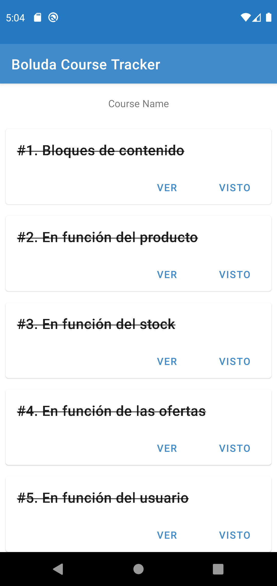
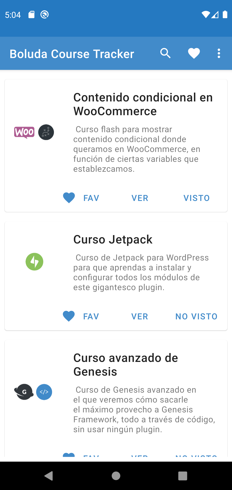
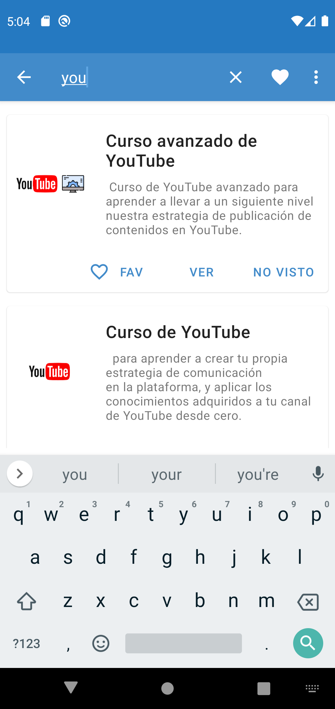

# Boluda Course Tracker - Android App (no oficial)
Aplicación para gestionar los cursos de Boluda.com, marcarlos como vistos y marcar favoritos

Aplicación desarrollada por <a href="https://dovaldev.com"><strong>dovaldev</strong></a> para marcar todos los cursos vistos y favoritos de la web de <a href="https://boluda.com">boluda.com</a>

  
<!-- DOVALDEV -->

  <h3 align="center">dovaldev</h3>
  

    Puedes encontrame en @dovaldev
     
    <a href="https://dovaldev.com"><strong>WEB</strong></a>
     
     
    <a href="https://twitter.com/dovaldev">Twitter</a>
    ·
    <a href="https://github.com/dovaldev">GitHub</a>
  

  
  
<!-- ABOUT THE PROJECT -->
## Sobre mi y el proyecto

    
    
    
 

Hace unos meses que me aficioné a escuchar los podcast de <b>Joan Boluda</b>, razón por la que al final me he suscrito a sus cursos (inbound marketing). Ahora ante la imposibilidad de llevar un registro de los cursos vistos he realizado esta app que no publicaré en el market.

El proyecto está realizado con mis conocimientos limitados de programación en Kotlin, usando código desarrollado por mi a lo largo de los años. Quizá encuentres alguna mejor forma de hacer algo, puedes contribuir si lo deseas.

<!-- INSTALL -->

Si quieres usarla e instalarla, tienes dos posibilidades:

<ul>
  <li>Instalarla mediante el enlace de <a href="https://github.com/dovaldev/boluda_course_tracker/tree/master/app/release">descarga</a>, activando la opción de origenes desconocidos.</li>
  <li>Descargar el proyecto en android studio y compilarla por ti mismo.</li>
</ul>

## Información

Estoy aprendiendo con todo esto y entiendo que el código es un poco lioso, intentaré pulir el código con las recomendaciones y sugerencias que me deis

## Por añadir
<ul>
<li>Añadir recordatorio del minuto pausado el capitulo</li>
<li>Opción para cargar los capítulos favoritos primero.</li>
<li>...atento a sugerencias.</li>
</ul>

## Desarrollado con ❤️

He realizado este proyecto con android studio y kotlin como lenguaje de programación.
* [Kotlin-android](https://kotlinlang.org/)
* [Libreria JSOUP-android](#)
* [Una porción de código de la Libreria Anko-android](#)

<!-- LICENSE -->
## Licencia

MIT License

Copyright (c) 2021 Juan A. Doval [@dovaldev]

Permission is hereby granted, free of charge, to any person obtaining a copy
of this software and associated documentation files (the "Software"), to deal
in the Software without restriction, including without limitation the rights
to use, copy, modify, merge, publish, distribute, sublicense, and/or sell
copies of the Software, and to permit persons to whom the Software is
furnished to do so, subject to the following conditions:

The above copyright notice and this permission notice shall be included in all
copies or substantial portions of the Software.

THE SOFTWARE IS PROVIDED "AS IS", WITHOUT WARRANTY OF ANY KIND, EXPRESS OR
IMPLIED, INCLUDING BUT NOT LIMITED TO THE WARRANTIES OF MERCHANTABILITY,
FITNESS FOR A PARTICULAR PURPOSE AND NONINFRINGEMENT. IN NO EVENT SHALL THE
AUTHORS OR COPYRIGHT HOLDERS BE LIABLE FOR ANY CLAIM, DAMAGES OR OTHER
LIABILITY, WHETHER IN AN ACTION OF CONTRACT, TORT OR OTHERWISE, ARISING FROM,
OUT OF OR IN CONNECTION WITH THE SOFTWARE OR THE USE OR OTHER DEALINGS IN THE
SOFTWARE.

  
<!-- MARKDOWN LINKS & IMAGES -->
[product-screenshot]: images/screenshot-fav.png
[dovaldev-url]: https://dovaldev.com
[boluda-url]: https://boluda.com
[app-url]: https://boluda.com
[@dovaldev]: https://dovaldev.com
